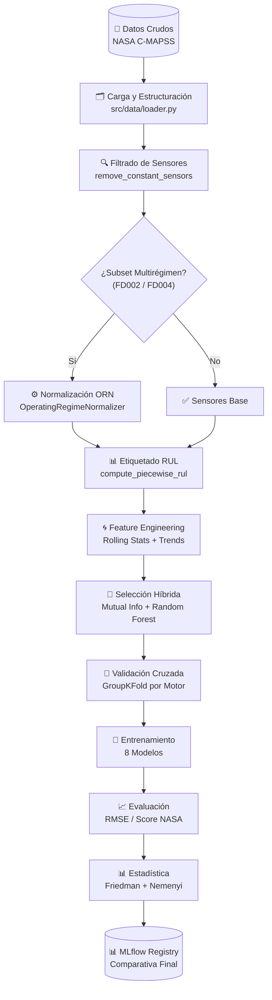
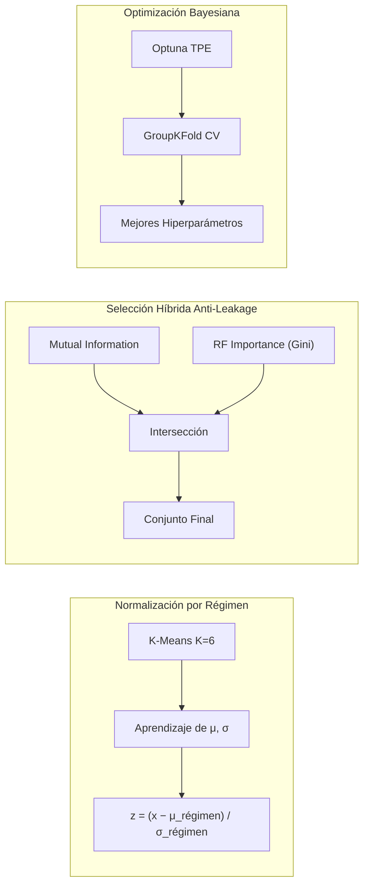
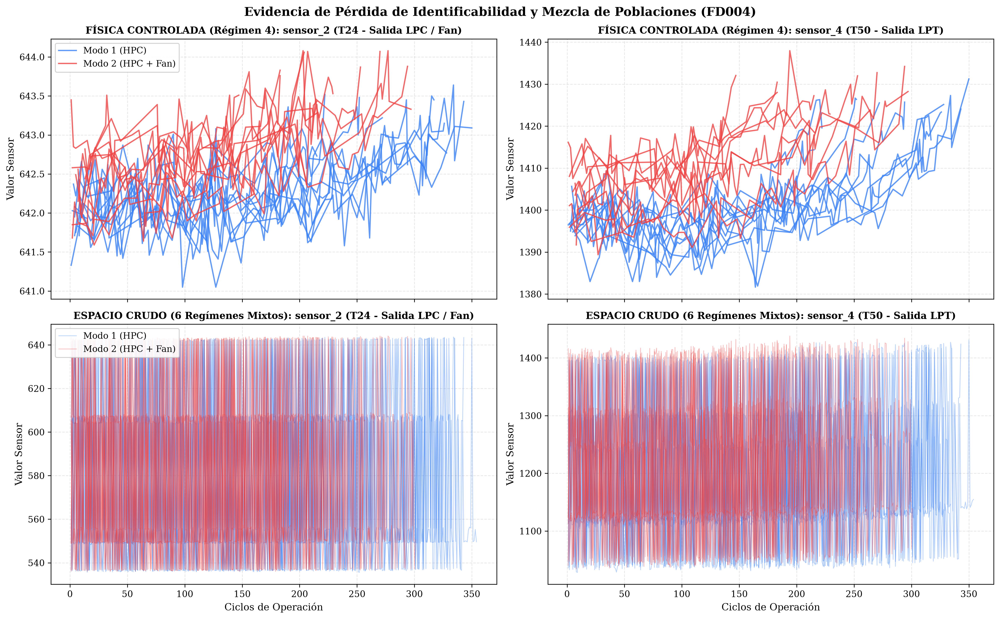
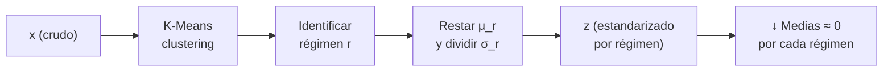
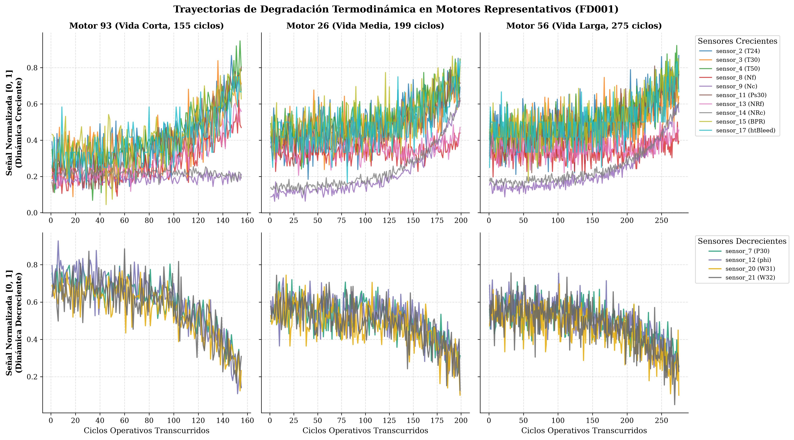
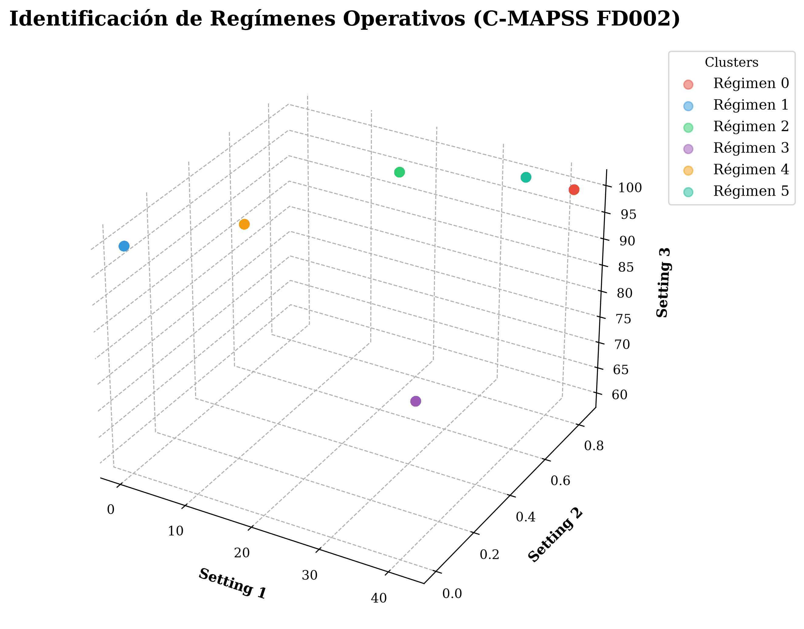
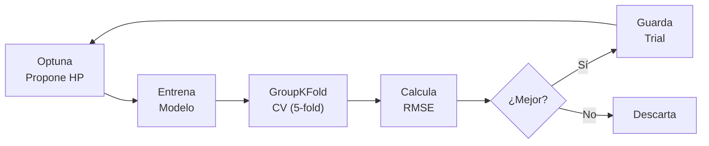

<div align="center">

# 🛩️ Predicción de Vida Útil Remanente (RUL) en Turbinas de Aviación

### Trabajo de Tesis — Procesamiento de Datos Complejo


**Predicción del Remaining Useful Life (RUL) de motores turbofán utilizando el dataset NASA C-MAPSS, con normalización por régimen operativo, selección híbrida de características y búsqueda bayesiana de hiperparámetros.**

</div>

---

## 📋 Índice

1. [Planteamiento del Problema](#-planteamiento-del-problema)
2. [Dataset: NASA C-MAPSS](#-dataset-nasa-c-mappss)
3. [Metodología General](#-metodología-general)
4. [Normalización por Régimen Operativo (ORN)](#-normalización-por-régimen-operativo-orn)
5. [Evidencia Visual del Análisis Exploratorio](#-evidencia-visual-del-análisis-exploratorio)
6. [Arquitectura del Proyecto](#-arquitectura-del-proyecto)
7. [Componentes del Sistema](#-componentes-del-sistema)
8. [Modelos Implementados](#-modelos-implementados)
9. [Herramientas y Librerías](#-herramientas-y-librerías)
10. [Instalación y Uso](#-instalación-y-uso)
11. [Resultados Esperados](#-resultados-esperados)

---

## 🎯 Planteamiento del Problema

Los turbinas de aviación operan en condiciones extremas de temperatura y presión. Su fallo inesperado tiene consecuencias catastróficas: accidentes aéreos, costos de mantenimiento millonarios y riesgos para la vida humana. La **mantención predictiva** (Predictive Maintenance) busca anticipar estos fallos estimando cuántos ciclos de operación le quedan a un motor antes de que falle: su **Vida Útil Remanente (Remaining Useful Life, RUL)**.

> **Definición formal:** el RUL en ciclo *t* de un motor es el número de ciclos operativos restantes hasta el fallo:
>
> `RUL(t) = T_fallo − t`

El reto técnico es complejo porque:

- Las señales de sensores (temperaturas, presiones, flujos) son **ruidosas** y degradan gradualmente.
- Los motores operan bajo **múltiples regímenes** (condiciones de vuelo), lo que mezcla poblaciones de datos y oculta la señal de degradación.
- El dataset contiene **múltiples modos de fallo** (componentes HPC, Fan, etc.) que afectan los sensores de forma diferente.

Este proyecto aborda estos desafíos con un pipeline de machine learning completo: desde el análisis exploratorio hasta la comparación estadística de modelos, pasando por una normalización innovadora por régimen operativo.

---

## 📊 Dataset: NASA C-MAPSS

El dataset **[NASA C-MAPSS](https://www.nasa.gov/intelligent-systems-division/discovery-and-systems-health/pcoe/pcoe-data-set-repository/)** (Commercial Modular Aero-propulsion System Simulation) contiene datos de simulación de motores turbofán de gran hélice con degradación progresiva. Cada motor arranca con condiciones de desgaste aleatorias y opera hasta el fallo.

| Subset | Motores (train/test) | Regímenes Operativos | Modos de Fallo | Complejidad |
|--------|---------------------|---------------------|----------------|-------------|
| **FD001** | 100 / 100 | 1 | 1 (HPC) | ⭐ Básica |
| **FD002** | 260 / 259 | **6** | 1 (HPC) | ⭐⭐⭐ Multirégimen |
| **FD003** | 100 / 100 | 1 | **2** (HPC + Fan) | ⭐⭐ Multimodo |
| **FD004** | 249 / 248 | **6** | **2** (HPC + Fan) | ⭐⭐⭐⭐ Completa |

**Columnas por registro:**
- **3 condiciones operativas** (`setting_1`, `setting_2`, `setting_3`): altitude, Mach number y Throttle Setting.
- **21 sensores** (`sensor_1` … `sensor_21`): medidas de temperatura, presión, flujo y velocidades.
- **RUL etiquetado** en el conjunto de entrenamiento; en test solo se conoce el ciclo final de operación.

---

## 🔬 Metodología General

El pipeline sigue una metodología rigurosa con validación cruzada **GroupKFold** por motor para evitar data leakage:



### Desglose de las Etapas Críticas



---

## ⚙️ Normalización por Régimen Operativo (ORN)

Los subsets FD002 y FD004 contienen datos de **6 regímenes operativos distintos**. Sin normalizar, las señales de sensores se mezclan y la degradación real se pierde en el ruido de operación:



*Figura clave: a la izquierda, la física controlada dentro de un régimen muestra claramente la separación entre modos de fallo. A la derecha, el espacio crudo mezcla todo y es indistinguible.*

**Solución: `OperatingRegimeNormalizer`**



La función `fit()` aprende las medias y desviaciones estándar de los **6 regímenes** usando K-Means (K=6) sobre las condiciones operativas. Luego `transform()` estandariza cada muestra restando la media de su régimen y dividiendo por su desviación:

```
z = (x − μ_régimen) / σ_régimen
```

**Resultado verificado:** medias por régimen ≈ 0 (error < 10⁻¹²), desviaciones = 1.0, y el espacio de operación queda limpio para que los modelos aprendan la degradación, no la operación.

---

## 🖼️ Evidencia Visual del Análisis Exploratorio

### Degradación Termodinámica en FD001



*Trayectorias de degradación en tres motores representativos (vida corta, media y larga). Los sensores superiores muestran tendencia creciente (temperaturas), los inferiores decreciente (flujos) — física consistente con el desgaste del motor.*

### Identificación de Regímenes Operativos en FD002



*Clustering K-Means (K=6) sobre las condiciones operativas (Settings 1, 2, 3) del subset FD002. Cada cluster corresponde a un régimen operativo distinto, validado con Silhouette Score = 0.60.*

---

## 🏗️ Arquitectura del Proyecto

```
rul-cmapss/
├── 📁 configs/                    # Configuraciones experimentales por subset
│   ├── config_FD001.yaml         #   Single-regime, single-mode
│   ├── config_FD002.yaml         #   Multi-regime, single-mode
│   ├── config_FD003.yaml         #   Single-regime, multi-mode
│   └── config_FD004.yaml         #   Multi-regime, multi-mode
│
├── 📁 datos/                      # Dataset NASA C-MAPSS (no incluido por licencia)
│
├── 📁 notebooks/                  # Análisis exploratorio (EDA)
│   ├── 01_eda_FD001.ipynb
│   ├── 02_eda_FD002.ipynb
│   ├── 03_eda_FD003.ipynb
│   ├── 04_eda_FD004.ipynb
│   └── 📁 figures/               # Figuras generadas (PNG + PDF 300 dpi)
│
├── 📁 scripts/                    # Puntos de entrada ejecutables
│   ├── optimize.py               # Búsqueda bayesiana de hiperparámetros
│   └── train_eval.py             # Entrenamiento + evaluación final
│
├── 📁 src/                        # Código fuente del pipeline
│   ├── 📁 data/                  # Carga y preprocesamiento
│   │   ├── loader.py            #   Lectura de archivos C-MAPSS
│   │   ├── preprocessing.py     #   ORN, eliminación de sensores, RUL
│   │   └── pipeline.py          #   Orquestación del flujo de datos
│   │
│   ├── 📁 features/             # Ingeniería de características
│   │   ├── engineering.py       #   Rolling stats, trends, ventanas
│   │   ├── selection.py         #   Selección híbrida (MI + RF)
│   │   └── windowing.py         #   Creación de secuencias temporales
│   │
│   ├── 📁 models/               # Modelos de machine learning
│   │   ├── factory.py           #   Fábrica abstracta de modelos
│   │   ├── base.py              #   Interfaz base
│   │   ├── sklearn_wrapper.py   #   Wrapper para modelos sklearn
│   │   ├── pytorch_wrapper.py   #   Wrapper para modelos PyTorch
│   │   ├── optimization.py      #   Integración con Optuna
│   │   └── [8 modelos implementados]
│   │
│   ├── 📁 evaluation/           # Métricas y validación
│   │   ├── metrics.py           #   RMSE, Score NASA
│   │   ├── cross_validation.py  #   GroupKFold por motor
│   │   └── statistical_tests.py #   Friedman, Nemenyi, Wilcoxon
│   │
│   ├── 📁 tracking/             # Registro de experimentos
│   │   └── mlflow_reporter.py   #   Logging a MLflow
│   │
│   └── 📁 utils/                # Utilidades
│       ├── config.py            #   Carga de YAMLs
│       └── reproducibility.py   #   Semillas aleatorias
│
├── 📁 tuned/                     # Hiperparámetros optimizados (JSON)
├── pyproject.toml                # Metadatos y dependencias
└── estandarizacion_regimen.md    # Documentación detallada de ORN
```

---

## 🔧 Componentes del Sistema

### 1. **Carga y Preprocesamiento** (`src/data/`)

| Módulo | Función Principal | Descripción |
|--------|-------------------|-------------|
| `loader.py` | `load_cmapss()` | Lee los archivos de texto del dataset C-MAPSS y los convierte en DataFrames de pandas. Separa features, etiquetas RUL y conjuntos de test. |
| `preprocessing.py` | `OperatingRegimeNormalizer` | Clase sklearn-compatible que implementa ORN. Aprendizaje por régimen en `fit()`, estandarización en `transform()`. |
| | `remove_constant_sensors()` | Elimina sensores con varianza ≈ 0 (identificados en EDA). |
| | `compute_piecewise_rul()` | Aplica la fórmula de RUL piecewise: `min(ciclo_max − ciclo, rul_max)`. |
| `pipeline.py` | `prepare_raw_data()` | **Orquestador principal**: carga → filtrado → ORN → RUL. Retorna train/test listos. |
| | `extract_features()` | Ejecuta feature engineering según la configuración YAML. |

### 2. **Ingeniería de Características** (`src/features/`)

| Módulo | Función | Descripción |
|--------|---------|-------------|
| `engineering.py` | `compute_rolling_stats()` | Calcula estadísticas en ventanas deslizantes (W=30 ciclos): media, desviación, min, max. Captura tendencias locales. |
| | `compute_trends()` | Derivadas finitas ΔS = S(t) − S(t−1). Detectan cambios abruptos. |
| | `create_windows()` | Convierte datos tabulares en secuencias 3D `(n_samples, window, features)` para modelos profundos. |
| `selection.py` | `MutualInformationSelector` | Selecciona características con mayor información mutua con el RUL. |
| | `RFFeatureSelector` | Selecciona por importancia (Gini) de un Random Forest. |
| | `create_feature_selector()` | Combina ambas técnicas (intersección) en un selector híbrido. |

### 3. **Modelos** (`src/models/`)

Los modelos heredan de una **interfaz común** (`base.py`) y se instancian vía **fábrica abstracta** (`factory.py`). Esto permite cambiar de modelo sin tocar el pipeline.

| Modelo | Tipo | Wrapper | Hiperparámetros Optimizados |
|--------|------|---------|----------------------------|
| `AssociativeMemory` | Asociativo | sklearn | threshold, alpha, beta |
| `RandomForest` | Ensemble Bagging | sklearn | n_estimators, max_depth, min_samples_split |
| `XGBoost` | Gradient Boosting | sklearn | n_estimators, max_depth, learning_rate, subsample |
| `LightGBM` | Gradient Boosting | sklearn | n_estimators, num_leaves, learning_rate |
| `SVR` | Kernel Method | sklearn | C, epsilon, kernel, gamma |
| `MLP` | Red Neuronal | PyTorch | hidden_dims, dropout, lr, batch_size |
| `CNN1D` | Convolucional 1D | PyTorch | channels, kernel_size, dropout, lr |
| `LSTM` | Recurrente | PyTorch | hidden_size, num_layers, dropout, lr |

### 4. **Evaluación** (`src/evaluation/`)

| Módulo | Métricas / Tests |
|--------|------------------|
| `metrics.py` | **RMSE** (Root Mean Squared Error), **Score NASA** (scoring function asymétrico que penaliza más las predicciones tardías). |
| `cross_validation.py` | **GroupKFold** con grupos por motor ID. Evita data leakage entre ventanas del mismo motor. |
| `statistical_tests.py` | **Friedman test** (comparación global), **Nemenyi post-hoc** (comparación por pares), **Wilcoxon signed-rank**. |

### 5. **Optimización** (`src/models/optimization.py`)

Integra **Optuna** (TPE sampler) para búsqueda bayesiana de hiperparámetros. El objetivo es minimizar el RMSE promedio en validación cruzada GroupKFold.



### 6. **Tracking** (`src/tracking/mlflow_reporter.py`)

Cada experimento se registra en **MLflow** con:
- **Parámetros**: configuración del modelo y del pipeline.
- **Métricas**: RMSE, Score NASA por fold y promedio.
- **Tags**: `subset`, `model_type`, `stage` (optimization/evaluation).
- **Artefactos**: JSON de hiperparámetros, figuras.

Para ver el UI de MLflow:
```bash
mlflow ui --backend-store-uri sqlite:///mlflow.db
# Abrir http://localhost:5000
```

---

## 🤖 Modelos Implementados

| Categoría | Modelos | Fortaleza |
|-----------|---------|-----------|
| **Clásicos / ML** | Random Forest, XGBoost, LightGBM, SVR | Rápidos, buenos con datos tabulares, interpretables |
| **Asociativo** | Memoria Asociativa | Modelo biológico inspirado, robusto a ruido |
| **Profundos / DL** | MLP, CNN1D, LSTM | Capturan dependencias temporales complejas |

**Estrategia de comparación:** todos los modelos usan las mismas características, el mismo esquema de validación (GroupKFold por motor) y las mismas métricas. La comparación es **justa y estadísticamente válida**.

---

## 🛠️ Herramientas y Librerías

### Core

| Librería | Versión | Uso Principal |
|----------|---------|---------------|
| **Python** | 3.11+ | Lenguaje de programación |
| **pandas** | ≥2.0.0 | Manipulación de datos tabulares |
| **NumPy** | ≥1.24.0 | Operaciones numéricas, arrays |
| **scikit-learn** | ≥1.5.0 | Modelos clásicos, métricas, validación cruzada |
| **PyTorch** | ≥2.0.0 | Modelos de deep learning (MLP, CNN, LSTM) |

### Optimización y Tracking

| Librería | Versión | Uso Principal |
|----------|---------|---------------|
| **Optuna** | ≥3.5.0 | Búsqueda bayesiana de hiperparámetros (TPE) |
| **MLflow** | ≥2.15.0 | Tracking de experimentos, registry |

### Gradient Boosting

| Librería | Versión | Uso Principal |
|----------|---------|---------------|
| **XGBoost** | ≥2.0.0 | Gradient Boosting optimizado para CPU/GPU |
| **LightGBM** | ≥4.0.0 | Gradient Boosting de alta velocidad |

### Visualización

| Librería | Versión | Uso Principal |
|----------|---------|---------------|
| **matplotlib** | ≥3.7.0 | Gráficos estáticos (publicación 300 dpi) |
| **seaborn** | ≥0.13.0 | Gráficos estadísticos atractivos |
| **plotly** | ≥5.18.0 | Gráficos interactivos (HTML) |

### Estadística

| Librería | Versión | Uso Principal |
|----------|---------|---------------|
| **scipy** | ≥1.11.0 | Tests estadísticos (Wilcoxon, Friedman) |
| **statsmodels** | ≥0.14.0 | Modelos estadísticos avanzados |
| **scikit-posthocs** | ≥0.8.0 | Post-hoc Nemenyi |
| **pingouin** | ≥0.5.3 | Análisis estadístico bayesiano |

### Utilidades

| Librería | Versión | Uso Principal |
|----------|---------|---------------|
| **PyYAML** | ≥6.0 | Configuración en archivos YAML |
| **joblib** | ≥1.3.0 | Serialización de modelos |
| **tqdm** | ≥4.65.0 | Barras de progreso |
| **psutil** | ≥5.9.0 | Monitoreo de recursos del sistema |
| **pytest** | ≥7.4.0 | Framework de testing |

---

## 🚀 Instalación y Uso

### Requisitos Previos

- Python 3.11 o superior
- [uv](https://docs.astral.sh/uv/) (gestor de paquetes recomendado) o pip
- Dataset NASA C-MAPSS descargado y extraído en `datos/`

### Instalación

```bash
# Clonar el repositorio
git clone https://github.com/tu-usuario/rul-cmapss.git
cd rul-cmapss

# Instalar dependencias con uv (recomendado)
uv sync

# O con pip
pip install -e .
```

### Estructura de Datos Esperada

```
datos/
├── train_FD001.txt
├── test_FD001.txt
├── RUL_FD001.txt
├── train_FD002.txt
├── test_FD002.txt
├── RUL_FD002.txt
├── ... (igual para FD003, FD004)
```

### Ejecución

#### 1. Análisis Exploratorio (EDA)

Abrir los notebooks en orden:
```bash
jupyter notebook notebooks/01_eda_FD001.ipynb
jupyter notebook notebooks/02_eda_FD002.ipynb
jupyter notebook notebooks/03_eda_FD003.ipynb
jupyter notebook notebooks/04_eda_FD004.ipynb
```

#### 2. Optimización de Hiperparámetros

```bash
# Optimizar un modelo específico
uv run python scripts/optimize.py --config configs/config_FD001.yaml --models random_forest

# Probar varios modelos
uv run python scripts/optimize.py --config configs/config_FD002.yaml --models xgboost lightgbm

# Modo dry-run (20 motores, 3 trials) para validar el pipeline
uv run python scripts/optimize.py --config configs/config_FD001.yaml --models random_forest --dry-run
```

#### 3. Entrenamiento y Evaluación Final

```bash
# Entrenar con los mejores hiperparámetros optimizados
uv run python scripts/train_eval.py --config configs/config_FD001.yaml --models random_forest

# Evaluar todos los modelos de un subset
uv run python scripts/train_eval.py --config configs/config_FD004.yaml --models random_forest xgboost lightgbm mlp cnn1d lstm

# Dry-run
uv run python scripts/train_eval.py --config configs/config_FD001.yaml --models random_forest --dry-run
```

#### 4. Ver Experimentos en MLflow

```bash
mlflow ui --backend-store-uri sqlite:///mlflow.db
```

Abrir `http://localhost:5000` en el navegador.

### Configuración Experimental

Cada subset tiene su propio archivo YAML en `configs/`. Ejemplo (`configs/config_FD002.yaml`):

```yaml
subset: FD002

data:
  data_dir: "datos"
  rul_max: 125           # Límite para RUL piecewise
  window_size: 30        # Tamaño de ventana para features
  operating_normalization: true   # ORN activo para multirégimen

sensors:
  remove: [1, 5, 6, 10, 16, 18, 19]  # Sensores invariantes (del EDA)

feature_engineering:
  rolling_stats:
    enabled: true
    window_size: 30
    stat_types: [mean, std, min, max]
  trends:
    enabled: true
    delta_steps: [1]

models:
  random_forest:
    n_estimators: [100, 300]
    max_depth: [5, 20]
    # ...
```

---

## 📈 Resultados Esperados

### Métricas de Evaluación

| Métrica | Fórmula | Interpretación |
|---------|---------|----------------|
| **RMSE** | `√(Σ(ŷᵢ − yᵢ)² / n)` | Error cuadrático medio (menor = mejor) |
| **Score NASA** | `Σ(exp(−d/13) − 1), d < 0; Σ(exp(d/10) − 1), d ≥ 0` | Score asimétrico. Penaliza más predicciones tardías (d > 0) que tempranas. |

### Validación Estadística

La comparación entre modelos no se basa solo en promedios. Se aplican:

1. **Friedman Test**: determina si hay diferencias significativas entre todos los modelos (α = 0.05).
2. **Nemenyi Post-hoc**: compara cada par de modelos y produce un **Critical Difference (CD) Diagram**.
3. **Wilcoxon Signed-Rank**: compara dos modelos específicos de forma robusta.

### Figuras de Resultados (Ejemplo)

Tras ejecutar el pipeline completo, se generan automáticamente:

- **Curvas de aprendizaje**: RMSE por fold de validación cruzada.
- **Diagrama de Critical Difference**: visualización de rankings de modelos.
- **Scatter plots**: predicción vs. valor real por motor.
- **Distribución de errores**: histograma de residuales.

---

## 📚 Referencias

- [1] E. Ramasso and A. Saxena, "Performance Benchmarking and Analysis of Prognostic Methods for CMAPSS Datasets," *International Journal of Prognostics and Health Management*, 2014.
- [2] NASA Prognostics Center of Excellence (PCoE), "CMAPSS Simulation Data Set," NASA Data Archive.
- [3] A. Saxena and K. Goebel, "Turbofan Engine Degradation Simulation Data Set," *NASA Prognostics Data Repository*, 2008.

---

## 📄 Licencia

Este proyecto está bajo la Licencia MIT. Ver [LICENSE](LICENSE) para más detalles.

---

## 👨‍🎓 Autor

**[Tu Nombre Aquí]**
Trabajo de Tesis — Procesamiento de Datos Complejo
[Nombre de la Universidad]
[Fecha]

---

<div align="center">
  <sub>Construido con ❤️ y ☕ para la academia</sub>
</div>
